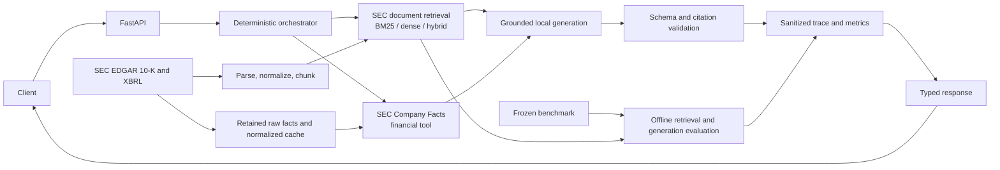

# Enterprise Knowledge Intelligence

An evidence-grounded knowledge system over real SEC 10-K filings. It combines SEC-aware ingestion and section chunking, dense and lexical retrieval, reciprocal-rank hybrid search, reranking experiments, local grounded generation, structured SEC Company Facts/XBRL data, deterministic agent routing, evaluation, end-to-end observability, and a typed FastAPI service with Docker and GitHub Actions CI.

The system addresses a common enterprise question pattern: an answer may require both narrative evidence and a precise structured fact. It retains filing provenance, validates citations and output structure, and abstains when evidence is missing. The saved experiments also document cases where those safeguards or the model did not work.

## Architecture



## Dataset and provenance

The corpus contains nine real SEC EDGAR 10-K filings: three each for Apple (AAPL), Microsoft (MSFT), and NVIDIA (NVDA). Source metadata preserves CIK, accession number, filing and report dates, SEC URL, and source-file hash. Parsing retains section and table text with source offsets; retrieval evidence and financial facts carry filing provenance through to tool results and traces.

SEC scripts use the `SEC_USER_AGENT` environment variable, 30-second request timeouts, and a conservative minimum 250 ms interval. No SEC request occurs during tests or API health checks. See [SEC data and evaluation methods](docs/evaluation.md) before rebuilding the local corpus.

## Measured retrieval results

Retrieval was evaluated against a frozen 100-question benchmark (90 answerable, 10 unanswerable). Recall@10 is macro-averaged recovery of exact annotated evidence under the saved overlap/provenance matcher; it is not semantic answer accuracy.

| System | Recall@10 |
| --- | ---: |
| Best dense baseline (recursive chunks) | 42.59% |
| Section-aware BM25 | 67.04% |
| Section-aware hybrid RRF | **69.26%** |
| Section-aware BM25 → cross-encoder, 20 candidates | 67.22% |
| Section-aware hybrid → cross-encoder, 20 candidates | 60.00% |

The selected section-aware hybrid result improved Recall@10 by **26.67 percentage points** over the best dense baseline. The comparison uses the best dense strategy across chunking variants; within section-aware chunks, dense scored 42.04%. Reranking was evaluated at candidate depths 20 and 50 but was not adopted as default: gains were inconsistent, and deeper reranking often reduced top-10 evidence recall. Full breakdowns and caveats are in the [retrieval experiment report](docs/evaluation.md) and detailed [dense](docs/dense_retrieval.md), [hybrid](docs/lexical_hybrid.md), and [reranking](docs/reranking.md) reports.

## Grounded generation evaluation

Phase 4B evaluated a deterministic 20-question representative subset with the local `qwen3:4b-instruct-2507-q4_K_M` model: 18 answerable and 2 unanswerable. Structured-output validity was 90%; 8/18 answerable outputs were accepted as substantive and the answerable false-abstention rate was 8/18. Both unanswerable cases abstained. Retrieval failed to supply a frozen evidence match for 10/18 answerable questions. Citation precision and recall were each 54.17% under the exact-span heuristic; mean pipeline latency was 16.947 seconds.

These are mixed, limited results, not a claim of reliable semantic correctness. The evaluator's answer and groundedness overlap heuristics do not establish semantic correctness or faithfulness. The detailed [generation report](docs/phase4b_results.md) preserves attribution and limitations.

## Deterministic agent and financial facts

The Phase 5 router selects document retrieval, structured financial data, both tools, or an unsupported-query abstention using deterministic rules before generation. The financial tool normalizes SEC Company Facts/XBRL with explicit concept mappings, annual-period checks, duplicate/amendment handling, and raw JSON pointers. Six supported metrics are revenue, net income, operating income, total assets, total liabilities, and cash and cash equivalents. The retained normalized caches contain **294 accepted facts** across AAPL, MSFT, and NVDA.

For example, Apple FY2025 revenue is **416,161,000,000 USD**, concept `RevenueFromContractWithCustomerExcludingAssessedTax`, from the 10-K filed 2025-10-31 (accession `0000320193-25-000079`; period end 2025-09-27). The raw Company Facts file hash and JSON pointer are preserved alongside the normalized fact. In the combined demonstration, the financial fact succeeded but retrieved document passages did not explain Apple's revenue drivers. The model's output failed validation; that partial-evidence failure was retained rather than tuned away. See the [Phase 5 summary](docs/phase5_final_summary.md).

## Observability and API

Phase 6 records unified sanitized traces across routing, tools, retrieval, generation, validation, latency, token use, provenance, and final status. A machine-readable failure taxonomy and deterministic aggregator preserve lower-level failures. Historical fields absent from Phase 4B/5 are reported unavailable rather than inferred. See the [observability report](docs/phase6_observability.md).

Phase 7 exposes typed FastAPI/Pydantic endpoints:

| Method | Endpoint | Purpose |
| --- | --- | --- |
| `GET` | `/health` | Lightweight process liveness |
| `GET` | `/ready` | Document, financial-cache, and optional Ollama readiness |
| `POST` | `/query` | Routed tool execution, grounded answer, validation, and trace ID |
| `POST` | `/retrieve` | Retrieval-only evidence and provenance |
| `GET` | `/trace/{trace_id}` | Sanitized saved trace |

Synchronous retrieval/tool/generation work runs in a bounded thread pool with request timeouts; errors are sanitized. The service reuses local caches and connects to an optional, separately running local Ollama service. It has no authentication or rate limiting and is not a multi-process production deployment. See [API usage](docs/api_service.md).

## Reproduce locally

Use Python 3.11. The SEC filings, parsed corpus, Company Facts cache, local model files, and generated caches are intentionally ignored by Git. Rebuild the data before running full data-backed validation or the API:

```bash
python3.11 -m venv .venv
.venv/bin/python -m pip install -r requirements.txt

# Set an operator-identifying SEC contact value in your shell; keep it out of source control.
export SEC_USER_AGENT='ProjectName/1.0 (contact: YOUR_CONTACT_VALUE)'
.venv/bin/python scripts/download_sec_filings.py
.venv/bin/python scripts/parse_sec_filings.py
.venv/bin/python scripts/chunk_sec_filings.py --strategy sec_section
.venv/bin/python scripts/download_sec_company_facts.py
.venv/bin/python scripts/rebuild_sec_company_facts.py
```

Dense and cross-encoder experiments additionally need their pinned model snapshots cached locally; see their detailed reports. The saved Phase 3/4/5 result files are evidence from the completed runs and are not regenerated by the commands above. Tests do not call SEC, Ollama, or paid services; corpus-backed regression tests skip if their ignored local data inputs have not been prepared.

The final prepared-corpus run passed **133 offline tests**. The tests use local fixtures and do not call SEC, Ollama, or paid services. Corpus-backed regression tests run when the ignored corpus artifacts exist and explicitly skip in a clean checkout without them. GitHub Actions runs this suite on Python 3.11.

To run the suite and service:

```bash
.venv/bin/python -m unittest discover -s tests -v
cp .env.example .env
set -a && . ./.env && set +a
.venv/bin/python -m src.api
```

Then open `http://127.0.0.1:8000/docs`. For generation, install/start Ollama separately and install the configured model with `ollama pull qwen3:4b-instruct-2507-q4_K_M`; set `EKI_OLLAMA_BASE_URL` and `EKI_OLLAMA_MODEL` to match that local service. The API never downloads a model. Configuration and Docker instructions are in [API usage](docs/api_service.md).

Build/run instructions for the provided Dockerfile are also in the API guide. The Dockerfile was not built locally because Docker was unavailable in the implementation environment.

## Repository map

```text
configs/       experiment, service, and protected-artifact settings
data/          local SEC sources and generated caches (ignored)
docs/          phase reports, evaluation methodology, and API guide
evals/         frozen benchmark and saved experiment/evaluation outputs
scripts/       ingestion, experiment, validation, and observability CLIs
src/           ingestion, retrieval, generation, agentic tools, API, observability
tests/         offline unit and artifact-backed regression tests
```

## Engineering decisions and limitations

Section-aware chunks respect SEC Item boundaries; BM25 performed strongly on the filing language, while hybrid RRF produced the best saved Recall@10. The cross-encoder remains an optional experiment rather than the default. Retrieval misses were the main measured bottleneck in the small generation evaluation. Deterministic routing precedes the LLM, financial queries use structured XBRL facts, and explicit output/citation validation and abstention prevent some unsupported answers. Failures remain in the saved reports.

The corpus is limited to three companies and nine filings. Dense retrieval can miss top-k evidence; the local 4B model produced invalid outputs and combined-question reasoning failures. The generation subset is small and its deterministic semantic proxies are limited. The API has no authentication, rate limiting, or distributed state. The Dockerfile is supplied but was not locally built. These results do not establish general retrieval superiority or authoritative semantic answer quality.

## Integrity and CI

The 100-question benchmark is frozen at SHA-256 `74a2e70d531e389a47730e8c537329ec65cfae5134abec3739a9297feba47e86`. Retrieval/generation runners and protected manifests verify benchmark and source artifacts before/after experiments. Historical outputs, including failures, remain available under `evals/`. Phase 8 scrubbed one absolute local Ollama binary path from installation metadata and updated the Phase 5/6 audit baselines for that metadata-only change; experiment outputs were not altered. `requirements.txt` uses bounded ranges rather than a full platform-specific lock; exact model revisions/digests and tested environment versions are recorded in experiment reports. GitHub Actions installs the declared dependencies and runs the offline unittest suite on Python 3.11 without Ollama or model downloads.
